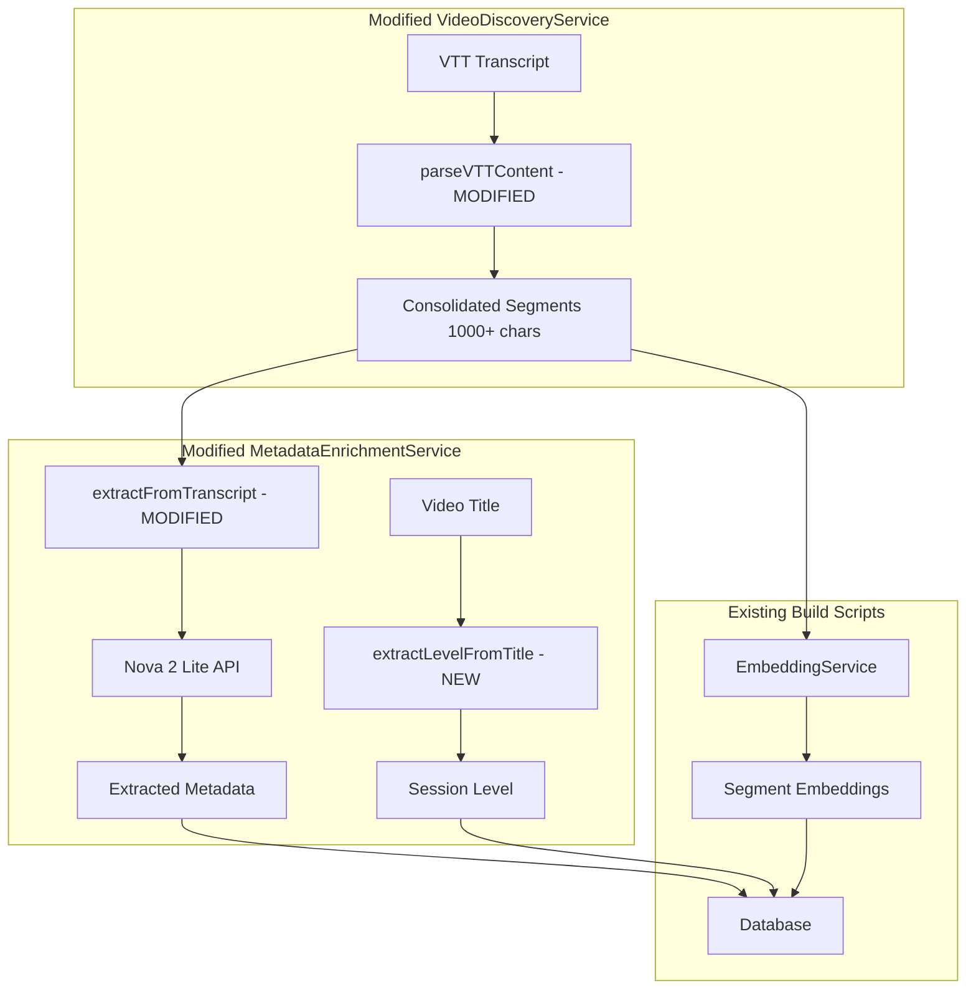

# Design Document: Transcript Processing Enhancement

## Overview

This design modifies the existing data pipeline to improve transcript processing. The current `VideoDiscoveryService.parseVTTContent()` creates thousands of tiny segments (one per VTT line), and `MetadataEnrichmentService` uses regex-based extraction. This enhancement:

1. **Replaces** the current VTT parsing to consolidate segments into chunks of at least 1000 characters
2. **Replaces** the regex-based metadata extraction with Amazon Nova 2 Lite AI extraction
3. **Adds** title-based level extraction using session codes (e.g., "GBL206" → 200 → Intermediate)

## Architecture



## Components and Interfaces

### 1. VideoDiscoveryService (Modified)

Modify `parseVTTContent()` to consolidate segments:

```typescript
// EXISTING - to be modified
private parseVTTContent(vttContent: string): Array<{
  startTime: number
  endTime: number
  text: string
  confidence: number
}>

// NEW - consolidation logic
private consolidateSegments(
  segments: VTTSegment[], 
  minChars: number = 1000
): ConsolidatedSegment[]
```

### 2. MetadataEnrichmentService (Modified)

Replace regex-based extraction with Nova 2 Lite:

```typescript
// EXISTING - to be replaced
async extractFromTranscript(transcript: string): Promise<ExtractedMetadata>

// NEW - Nova 2 Lite integration
private bedrockClient: BedrockRuntimeClient
private readonly MODEL_ID = 'amazon.nova-2-lite-v1:0'

async extractFromTranscriptWithNova(transcript: string): Promise<ExtractedMetadata>

// NEW - title-based level extraction
extractLevelFromTitle(title: string): SessionLevel
```

## Data Models

### ConsolidatedSegment
```typescript
interface ConsolidatedSegment {
  id: string              // Generated ID: {videoId}_chunk_{index}
  videoId: string         // Reference to source video
  startTime: number       // Start timestamp in seconds
  endTime: number         // End timestamp in seconds
  text: string            // Consolidated text content
  embedding: number[]     // Vector embedding
}
```

### VideoMetadata (Enhanced)
```typescript
interface VideoMetadata {
  // Existing fields...
  level: SessionLevel           // Derived from title
  speakers: string[]            // Extracted by Nova 2 Lite
  services: string[]            // Extracted by Nova 2 Lite
  topics: string[]              // Extracted by Nova 2 Lite
  industry: string[]            // Extracted by Nova 2 Lite
  transcriptSummary: string     // Generated by Nova 2 Lite
}
```

## Correctness Properties

*A property is a characteristic or behavior that should hold true across all valid executions of a system-essentially, a formal statement about what the system should do. Properties serve as the bridge between human-readable specifications and machine-verifiable correctness guarantees.*

### Property 1: Minimum segment size
*For any* transcript with total characters >= 1000, all consolidated segments except the last one SHALL have at least 1000 characters.
**Validates: Requirements 1.1**

### Property 2: Timestamp preservation
*For any* consolidated segment, its startTime SHALL equal the startTime of its first source VTT segment, and its endTime SHALL equal the endTime of its last source VTT segment.
**Validates: Requirements 1.2**

### Property 3: Level mapping correctness
*For any* video title containing a session code with level indicator (1xx, 2xx, 3xx, 4xx), the extracted level SHALL correctly map to Introductory, Intermediate, Advanced, or Expert respectively.
**Validates: Requirements 3.1, 3.3**

### Property 4: Segment-video relationship integrity
*For any* consolidated segment stored in the database, its videoId SHALL reference an existing video record.
**Validates: Requirements 4.3**

### Property 5: Long segment splitting at sentence boundaries
*For any* consolidated segment that exceeds embedding model limits, the split SHALL occur at sentence boundaries (period, question mark, or exclamation mark followed by space).
**Validates: Requirements 4.2**

## Error Handling

1. **Nova 2 Lite API Failures**: Retry with exponential backoff (3 attempts), then fall back to regex-based extraction
2. **Empty Transcripts**: Skip metadata extraction, use title-based metadata only
3. **Rate Limiting**: Implement request throttling with configurable delay between API calls
4. **Invalid VTT Format**: Log warning and skip transcript, continue with video metadata only

## Testing Strategy

### Unit Tests
- Test segment consolidation with various input sizes
- Test level extraction with different title formats
- Test sentence boundary detection for segment splitting

### Property-Based Tests
- Use fast-check to verify minimum segment size property
- Use fast-check to verify timestamp preservation property
- Use fast-check to verify level mapping correctness

### Integration Tests
- Test Nova 2 Lite API integration with sample transcripts
- Test end-to-end pipeline with real video data
