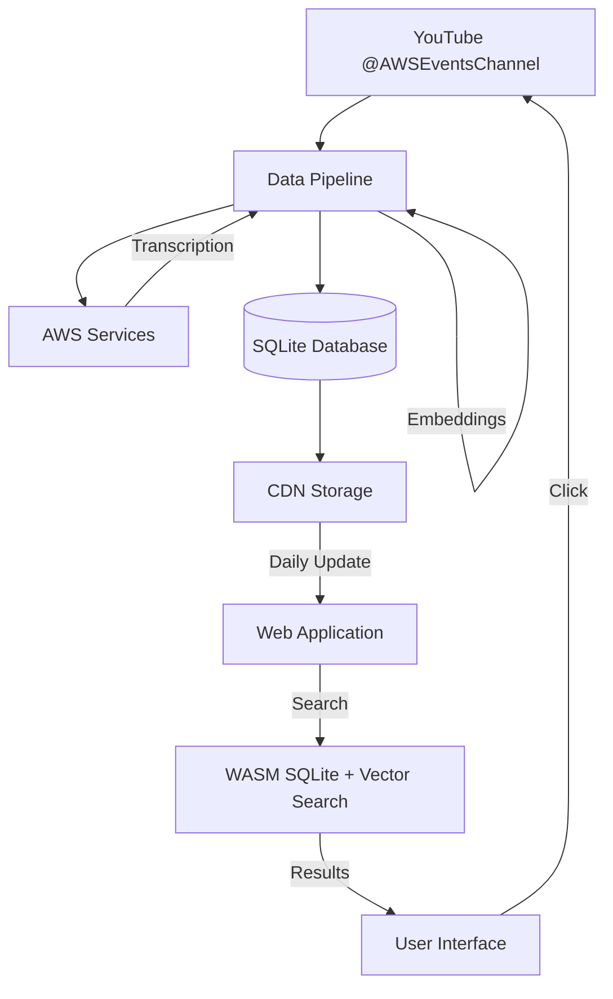

# Design Document

## Overview

The AWS re:Invent 2025 Video Search Platform is a client-side web application that provides semantic and keyword search capabilities for AWS re:Invent conference videos. The system consists of two main components: a server-side data pipeline that processes videos daily, and a client-side application that runs entirely in the browser using a pre-built SQLite database served from a CDN.

The architecture prioritizes simplicity, performance, and cost-effectiveness by eliminating server-side search infrastructure while providing instant search results through client-side processing.

## Architecture

### High-Level Architecture



### Data Pipeline Architecture

The data pipeline runs as a scheduled job (daily) and performs the following operations:

1. **Video Discovery**: Uses yt-dlp to fetch video listings from AWS Events Channel
2. **Content Processing**: Downloads metadata and transcripts using yt-dlp
3. **Metadata Enrichment**: Extracts metadata from transcript content using AI analysis
4. **Embedding Generation**: Creates vector embeddings using AWS Bedrock (Nova 2) from transcript content
5. **Database Update**: Updates SQLite database with extracted metadata and content
6. **CDN Deployment**: Pushes updated database to CDN

### Client-Side Architecture

The web application loads entirely in the browser and includes:

1. **Database Loader**: Downloads and initializes SQLite database from CDN
2. **Search Engine**: Hybrid search combining vector similarity and keyword matching
3. **User Interface**: React-based responsive interface
4. **Result Renderer**: Displays search results with video segments and timestamps

## Components and Interfaces

### Data Pipeline Components

#### VideoDiscoveryService
```typescript
interface VideoDiscoveryService {
  fetchChannelVideos(channelUrl: string): Promise<VideoMetadata[]>
  filterReInventVideos(videos: VideoMetadata[]): VideoMetadata[]
  identifyNewVideos(videos: VideoMetadata[], existing: VideoMetadata[]): VideoMetadata[]
}
```

#### TranscriptExtractionService
```typescript
interface TranscriptExtractionService {
  extractTranscript(videoId: string): Promise<Transcript>
  segmentTranscript(transcript: Transcript): VideoSegment[]
}
```

#### MetadataEnrichmentService
```typescript
interface MetadataEnrichmentService {
  extractFromTranscript(transcript: string): Promise<ExtractedMetadata>
  extractFromVideoMetadata(videoMetadata: any): Promise<ExtractedMetadata>
  combineMetadata(transcriptMeta: ExtractedMetadata, videoMeta: ExtractedMetadata): EnrichedMetadata
}

interface ExtractedMetadata {
  inferredServices: string[]
  inferredTopics: string[]
  inferredLevel: 'Introductory' | 'Intermediate' | 'Advanced' | 'Expert' | 'Unknown'
  sessionType: 'Breakout' | 'Chalk Talk' | 'Workshop' | 'Keynote' | 'Lightning Talk' | 'Unknown'
  speakers: string[]
  keyTerms: string[]
  confidence: number
}

interface EnrichedMetadata {
  level: 'Introductory' | 'Intermediate' | 'Advanced' | 'Expert' | 'Unknown'
  services: string[]
  topics: string[]
  industry: string[]
  sessionType: 'Breakout' | 'Chalk Talk' | 'Workshop' | 'Keynote' | 'Lightning Talk' | 'Unknown'
  speakers: string[]
  dataSource: 'transcript' | 'video-metadata' | 'combined'
  confidence: number
  extractedKeywords: string[]
}
```

#### EmbeddingService
```typescript
interface EmbeddingService {
  generateEmbeddings(text: string): Promise<number[]>
  batchGenerateEmbeddings(texts: string[]): Promise<number[][]>
}

interface VideoSegment {
  id: string
  videoId: string
  startTime: number
  endTime: number
  text: string
  embedding: number[]
}
```

#### DatabaseService
```typescript
interface DatabaseService {
  updateVideoMetadata(videos: VideoMetadata[]): Promise<void>
  insertVideoSegments(segments: VideoSegment[]): Promise<void>
  optimizeDatabase(): Promise<void>
  exportToFile(path: string): Promise<void>
}
```

### Client-Side Components

#### DatabaseLoader
```typescript
interface DatabaseLoader {
  downloadDatabase(url: string): Promise<ArrayBuffer>
  initializeSQLite(buffer: ArrayBuffer): Promise<Database>
  checkForUpdates(): Promise<boolean>
}
```

#### SearchEngine
```typescript
interface SearchEngine {
  hybridSearch(query: string, options: SearchOptions): Promise<SearchResult[]>
  vectorSearch(embedding: number[], limit: number): Promise<VideoSegment[]>
  keywordSearch(query: string, options: SearchOptions): Promise<VideoSegment[]>
  combineResults(vectorResults: VideoSegment[], keywordResults: VideoSegment[]): SearchResult[]
}

interface SearchOptions {
  dateRange?: { start: Date; end: Date }
  channels?: string[]
  duration?: { min: number; max: number }
  level?: ('Introductory' | 'Intermediate' | 'Advanced' | 'Expert')[]
  services?: string[]
  topics?: string[]
  industry?: string[]
  sessionType?: ('Breakout' | 'Chalk Talk' | 'Workshop' | 'Keynote' | 'Lightning Talk')[]
  metadataSource?: ('transcript' | 'video-metadata' | 'combined')[]
  limit?: number
}

interface SearchResult {
  video: VideoMetadata
  segments: VideoSegment[]
  relevanceScore: number
}
```

#### UserInterface
```typescript
interface UserInterface {
  renderSearchBar(): JSX.Element
  renderFilters(): JSX.Element
  renderResults(results: SearchResult[]): JSX.Element
  renderVideoSegment(segment: VideoSegment): JSX.Element
}
```

## Data Models

### VideoMetadata
```typescript
interface VideoMetadata {
  id: string
  title: string
  description: string
  channelId: string
  channelTitle: string
  publishedAt: Date
  duration: number
  thumbnailUrl: string
  youtubeUrl: string
  
  // Enriched metadata
  level: 'Introductory' | 'Intermediate' | 'Advanced' | 'Expert' | 'Unknown'
  services: string[]
  topics: string[]
  industry: string[]
  sessionType: 'Breakout' | 'Chalk Talk' | 'Workshop' | 'Keynote' | 'Lightning Talk' | 'Unknown'
  speakers: string[]
  
  // Metadata source tracking
  metadataSource: 'transcript' | 'video-metadata' | 'combined'
  metadataConfidence: number
  extractedKeywords: string[]
}
```

### Transcript
```typescript
interface Transcript {
  videoId: string
  language: string
  confidence: number
  segments: TranscriptSegment[]
}

interface TranscriptSegment {
  startTime: number
  endTime: number
  text: string
  confidence: number
  speaker?: string
}
```

### Database Schema
```sql
-- Videos table
CREATE TABLE videos (
  id TEXT PRIMARY KEY,
  title TEXT NOT NULL,
  description TEXT,
  channel_id TEXT NOT NULL,
  channel_title TEXT NOT NULL,
  published_at DATETIME NOT NULL,
  duration INTEGER NOT NULL,
  thumbnail_url TEXT,
  youtube_url TEXT NOT NULL,
  
  -- Enriched metadata
  level TEXT NOT NULL DEFAULT 'Unknown',
  services TEXT, -- JSON array
  topics TEXT,   -- JSON array
  industry TEXT, -- JSON array
  session_type TEXT NOT NULL DEFAULT 'Unknown',
  speakers TEXT, -- JSON array
  
  -- Metadata tracking
  metadata_source TEXT NOT NULL DEFAULT 'transcript',
  metadata_confidence REAL DEFAULT 0.0,
  extracted_keywords TEXT, -- JSON array
  
  created_at DATETIME DEFAULT CURRENT_TIMESTAMP,
  updated_at DATETIME DEFAULT CURRENT_TIMESTAMP
);

-- Video segments table
CREATE TABLE video_segments (
  id TEXT PRIMARY KEY,
  video_id TEXT NOT NULL,
  start_time REAL NOT NULL,
  end_time REAL NOT NULL,
  text TEXT NOT NULL,
  embedding BLOB NOT NULL, -- Serialized float array
  confidence REAL,
  speaker TEXT,
  FOREIGN KEY (video_id) REFERENCES videos (id)
);

-- Search optimization indexes
CREATE INDEX idx_videos_published_at ON videos (published_at);
CREATE INDEX idx_videos_duration ON videos (duration);
CREATE INDEX idx_videos_level ON videos (level);
CREATE INDEX idx_videos_session_type ON videos (session_type);
CREATE INDEX idx_videos_metadata_source ON videos (metadata_source);
CREATE INDEX idx_segments_video_id ON video_segments (video_id);
CREATE INDEX idx_segments_time ON video_segments (start_time, end_time);
CREATE VIRTUAL TABLE segments_fts USING fts5(text, content='video_segments', content_rowid='rowid');
CREATE VIRTUAL TABLE videos_fts USING fts5(title, services, topics, industry, speakers, extracted_keywords, content='videos', content_rowid='rowid');
```

## Correctness Properties

*A property is a characteristic or behavior that should hold true across all valid executions of a system-essentially, a formal statement about what the system should do. Properties serve as the bridge between human-readable specifications and machine-verifiable correctness guarantees.*

### Property Reflection

After analyzing all acceptance criteria, several properties can be consolidated to eliminate redundancy:

- **Search result properties** (1.2, 5.1, 5.3) can be combined into a comprehensive result rendering property
- **Filtering properties** (2.1, 2.2, 2.3, 2.4) can be unified into a general filtering property
- **URL generation properties** (1.3, 5.2) can be combined since they both test YouTube URL generation
- **Pipeline processing properties** (4.3, 4.4, 4.5) can be consolidated into a comprehensive processing property

### Core Properties

**Property 1: Hybrid search combines semantic and keyword results**
*For any* search query, the hybrid search function should return results that include both semantically similar content (via embeddings) and exact keyword matches, with appropriate relevance scoring
**Validates: Requirements 1.1, 1.4**

**Property 2: Search results contain required information**
*For any* search result, the rendered output should include video title, channel, duration, upload date, relevance score, segment timestamps, and transcript excerpts
**Validates: Requirements 1.2, 5.1, 5.3**

**Property 3: YouTube URL generation with timestamps**
*For any* video segment or search result, clicking should generate a valid YouTube URL with the correct video ID and timestamp parameters
**Validates: Requirements 1.3, 5.2**

**Property 4: Filter application preserves constraints**
*For any* combination of active filters (date, channel, duration, category), all returned results should satisfy every active filter constraint simultaneously
**Validates: Requirements 2.1, 2.2, 2.3, 2.4, 2.5**

**Property 5: Offline functionality after database load**
*For any* search operation after database initialization, the platform should function without making network requests
**Validates: Requirements 3.2, 3.3**

**Property 6: Video processing pipeline completeness**
*For any* new video discovered by the pipeline, the complete processing workflow (metadata extraction, transcription, embedding generation, database update) should execute successfully
**Validates: Requirements 4.3, 4.4, 4.5**

**Property 7: Pipeline error resilience**
*For any* processing error in the data pipeline, the system should log the failure and continue processing remaining videos without stopping the entire pipeline
**Validates: Requirements 4.6, 9.2**

**Property 8: re:Invent video filtering accuracy**
*For any* video listing from the AWS Events Channel, only videos with titles starting with "AWS re:Invent 2025" should be included in processing
**Validates: Requirements 4.2, 8.2**

**Property 9: Segment grouping and ordering**
*For any* search results containing multiple segments from the same video, segments should be grouped under the video title and ordered by relevance score within each group
**Validates: Requirements 5.4, 5.5**

**Property 10: Category filtering and counting**
*For any* category selection, the platform should return only videos tagged with that category and display accurate video counts for each available category
**Validates: Requirements 6.2, 6.5**

**Property 11: Topic browsing order**
*For any* topic browsing operation, videos should be ordered by a combination of relevance and recency scores
**Validates: Requirements 6.3**

**Property 12: Retry behavior with exponential backoff**
*For any* network failure (channel access, CDN resources), the system should implement exponential backoff retry logic with appropriate maximum retry limits
**Validates: Requirements 8.3, 9.3**

**Property 13: Metadata enrichment completeness**
*For any* processed video, the system should extract metadata from both transcript content and video metadata using yt-dlp, ensuring every video has level, services, topics, and session type information
**Validates: Requirements 4.3, 4.4**

**Property 14: Metadata update preservation**
*For any* video with changing metadata, the system should update the new information while preserving the original video record and associated segments in the database
**Validates: Requirements 8.5**

## Error Handling

### Client-Side Error Handling

**Database Loading Errors**
- Network failures during database download
- Corrupted database files
- Browser storage limitations
- Fallback to cached versions when available

**Search Operation Errors**
- Invalid query parameters
- Database query failures
- Vector search computation errors
- Graceful degradation to keyword-only search

**Browser Compatibility Issues**
- WebAssembly support detection
- SQLite WASM initialization failures
- Feature detection and polyfills
- Progressive enhancement approach

### Data Pipeline Error Handling

**YouTube Access Errors**
- Channel unavailability
- Rate limiting
- Video access restrictions
- Retry with exponential backoff

**Processing Errors**
- Transcription service failures
- Embedding generation errors
- Database update conflicts
- Partial processing recovery

**Infrastructure Errors**
- AWS service outages
- CDN deployment failures
- Storage quota exceeded
- Monitoring and alerting

## Testing Strategy

### Dual Testing Approach

The system requires both unit testing and property-based testing to ensure comprehensive coverage:

- **Unit tests** verify specific examples, edge cases, and error conditions
- **Property tests** verify universal properties that should hold across all inputs
- Together they provide comprehensive coverage: unit tests catch concrete bugs, property tests verify general correctness

### Unit Testing Requirements

Unit tests will cover:
- Specific examples that demonstrate correct behavior
- Integration points between components
- Error conditions and edge cases
- Browser compatibility scenarios

### Property-Based Testing Requirements

**Testing Framework**: We will use **fast-check** for JavaScript/TypeScript property-based testing, which provides excellent support for generating complex test data and shrinking failing cases.

**Configuration Requirements**:
- Each property-based test must run a minimum of 100 iterations to ensure adequate coverage
- Each property-based test must be tagged with a comment explicitly referencing the correctness property from this design document
- Tag format: `**Feature: video-search-platform, Property {number}: {property_text}**`
- Each correctness property must be implemented by a single property-based test

**Property Test Implementation**:
- Property 1: Generate random search queries and verify hybrid search returns both semantic and keyword matches
- Property 2: Generate random search results and verify all required fields are present in rendered output
- Property 3: Generate random video segments and verify YouTube URL generation includes correct parameters
- Property 4: Generate random filter combinations and verify all results satisfy active constraints
- Property 5: Generate random search operations and verify no network requests after database load
- Property 6: Generate random new videos and verify complete processing pipeline execution
- Property 7: Generate random processing errors and verify pipeline continues with remaining videos
- Property 8: Generate random video listings and verify only re:Invent 2025 videos are processed
- Property 9: Generate random multi-segment results and verify grouping and ordering behavior
- Property 10: Generate random category selections and verify filtering accuracy and count correctness
- Property 11: Generate random topic browsing requests and verify relevance/recency ordering
- Property 12: Generate random network failures and verify exponential backoff retry behavior
- Property 13: Generate random metadata updates and verify preservation of original records

### Integration Testing

**End-to-End Workflow Testing**:
- Complete data pipeline execution from video discovery to database deployment
- Client-side application loading and search functionality
- Cross-browser compatibility testing
- Performance testing with realistic data volumes

**API Integration Testing**:
- YouTube Data API integration
- AWS Transcribe service integration
- AWS Bedrock embedding generation
- CDN deployment and retrieval

### Performance Testing

**Client-Side Performance**:
- Database loading time measurement
- Search response time benchmarking
- Memory usage monitoring
- Mobile device performance validation

**Data Pipeline Performance**:
- Video processing throughput
- Transcription service latency
- Embedding generation performance
- Database update efficiency

## Implementation Notes

### Technology Stack

**Data Pipeline**:
- **Runtime**: Node.js with TypeScript
- **Video Processing**: yt-dlp for YouTube integration and transcript extraction
- **Metadata Extraction**: AWS Bedrock (Nova 2 Lite) for transcript analysis
- **Embeddings**: AWS Bedrock (Nova 2) for semantic search
- **Database**: SQLite with better-sqlite3
- **Deployment**: AWS Lambda + EventBridge for scheduling

**Client Application**:
- **Framework**: React with TypeScript
- **Database**: SQLite WASM (sql.js)
- **Vector Search**: Custom implementation or hnswlib-wasm
- **Build Tool**: Vite for optimal bundling
- **Styling**: Tailwind CSS for responsive design

### Database Optimization

**Size Optimization**:
- Compress embeddings using quantization techniques
- Use efficient binary serialization for vector data
- Implement database compression (GZIP) for CDN delivery
- Optimize SQLite schema for query performance

**Query Optimization**:
- Create appropriate indexes for common query patterns
- Use FTS5 for full-text search capabilities
- Implement query result caching
- Optimize vector similarity search algorithms

### Metadata Enrichment Strategy

**yt-dlp Video Metadata Extraction**:
- Extract comprehensive video metadata using yt-dlp including title, description, tags, and chapters
- Parse video descriptions for session information and speaker details
- Extract structured data from video tags and categories
- Use video upload metadata and channel information

**Transcript-Based Extraction**:
- Use yt-dlp to extract transcript content directly from YouTube
- Use AWS Bedrock (Nova 2 Lite) to analyze transcript content
- Extract AWS services mentioned in the content
- Infer technical level based on language complexity and concepts
- Identify topics and industry focus from content analysis
- Generate confidence scores for extracted metadata

**Combined Metadata Strategy**:
- Combine video metadata and transcript analysis for comprehensive coverage
- Use video description and tags as primary source for structured data
- Use transcript analysis for deeper content understanding
- Track metadata source and confidence for transparency

**Metadata Quality Assurance**:
- Validate extracted services against known AWS service catalog
- Cross-reference topics with AWS documentation taxonomy
- Implement confidence thresholds for metadata inclusion
- Regular validation of extraction accuracy

### Deployment Strategy

**CDN Configuration**:
- Use CloudFront for global distribution
- Implement proper caching headers
- Enable compression for database files
- Set up cache invalidation for updates

**Update Mechanism**:
- Implement versioned database files
- Use ETags for efficient update detection
- Provide progressive loading for large databases
- Implement fallback to previous versions on failure

### Security Considerations

**Data Privacy**:
- No user data collection or tracking
- All processing happens client-side
- No server-side logging of search queries
- Transparent data usage policies

**Content Security**:
- Validate all YouTube content before processing
- Implement content filtering for inappropriate material
- Secure API key management for AWS services
- Regular security audits of dependencies

### Scalability Considerations

**Data Growth**:
- Plan for thousands of re:Invent videos
- Implement database partitioning strategies
- Consider incremental loading for large datasets
- Monitor client-side memory usage

**Traffic Scaling**:
- CDN handles traffic spikes automatically
- No server-side scaling concerns
- Client-side processing scales with user devices
- Monitor CDN costs and usage patterns